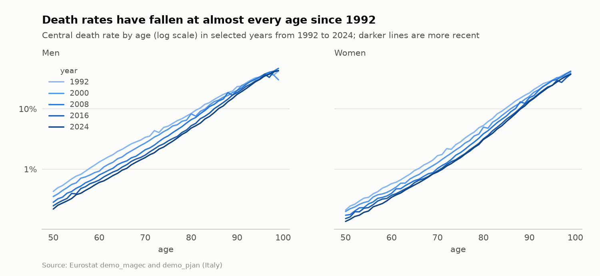
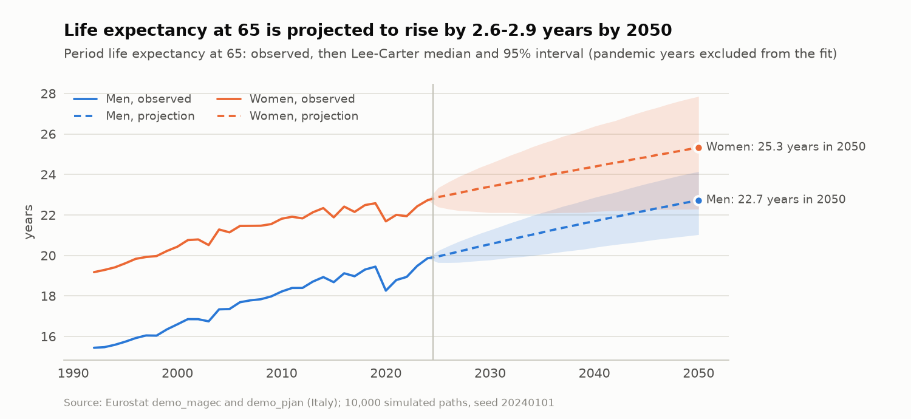
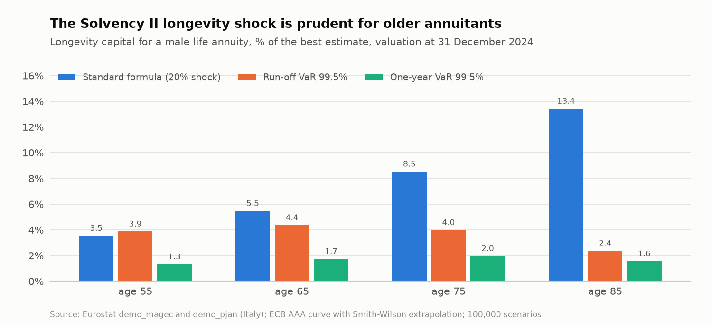

# Actuarial Mathematics


**Life insurance and pension mathematics with stochastic mortality: Lee-Carter projections on official Eurostat data, a C++ Monte Carlo engine for annuity portfolios, and Solvency II valuation and capital.**

The repository covers the work of a life or pension actuary from data to decision: building a projected mortality basis, valuing annuities with a market-consistent discount curve, measuring longevity risk with an internal-model view and with the Solvency II standard formula, and pricing a bulk annuity (buy-in) for a pension fund. Simulation-heavy parts run in C++; estimation, valuation and reporting are in Python.

## Highlights

Results on official data: Eurostat deaths and population for Italy, 1992-2024, and the ECB AAA yield curve at 31 December 2024.

| Area | What is done | Key result |
| --- | --- | --- |
| Pension buy-in pricing (case study) | Quote for an Italian pension fund with 1,500 pensioners (illustrative membership): cohort mortality basis, Smith-Wilson curve, best estimate and duration, standard-formula SCR (longevity, expense, interest rate, operational), cost-of-capital risk margin, premium with a shareholder hurdle rate, internal-model cross-check, sensitivities and a board summary | Premium 106.9% of the best estimate (EUR 410 million for EUR 28 million of annual pensions), 1.12 times the fund's period-table book value, the gap being mostly future mortality improvements; SCR 7.0% and risk margin 4.2% of the best estimate; indexing pensions by 2% a year would add 23.5% to the premium |
| Mortality projection | Poisson Lee-Carter by sex on Eurostat deaths and population, pandemic years excluded, deviance diagnostics, out-of-sample backtest of forecast intervals, period versus cohort life expectancy | Mortality at 65 improves by about 2.6% a year for men and 1.6% for women; life expectancy at 65 in 2024 is 19.8 years for men and 22.8 for women on a period basis, 21.4 and 24.4 on a cohort basis; including 2020-2022 would raise the estimated trend volatility by 76% for men; the 95% forecast intervals contain all ten out-of-sample years |
| Longevity capital | Run-off and one-year value at risk (re-estimation of the trend, Richards et al. 2014) against the 20% Solvency II longevity shock, by age and interest-rate level; pooling of idiosyncratic risk | For a male annuitant aged 65 the standard-formula shock costs 5.5% of the best estimate, against 4.4% for the run-off 99.5% VaR and 1.7% for the one-year VaR: the standard formula is prudent from 65 upwards (13.4% against 2.4% at 85), but not at 55, where the run-off VaR (3.9%) exceeds the shock (3.5%) |
| Discounting | ECB AAA yield curve extrapolated with the Smith-Wilson method and EIOPA convergence criterion | Convergence to the 3.30% ultimate forward rate within 1 basis point at 60 years |
| Engineering | C++17 engine with portable, thread-independent random streams, NumPy reference implementations | 100,000 portfolio scenarios with 1,500 simulated lifetimes each in about 3 seconds on four cores; 39 automated tests against closed forms, exact moments and NumPy references |

## Charts

<picture>
  <source media="(prefers-color-scheme: dark)" srcset="docs/figures/mortality_rates-dark.png">
  
</picture>

<picture>
  <source media="(prefers-color-scheme: dark)" srcset="docs/figures/life_expectancy_65-dark.png">
  
</picture>

<picture>
  <source media="(prefers-color-scheme: dark)" srcset="docs/figures/longevity_capital-dark.png">
  
</picture>

The charts are drawn by `python -m longevity_risk.readme_figures` with the same data, model and seeds as the notebooks (light and dark variants in `docs/figures/`).

## Catalogue

| Item | Question answered | Data |
| --- | --- | --- |
| [`scripts/longevity_risk`](scripts/longevity_risk/README.md) (library) | Reusable Lee-Carter estimation, C++ simulation of annuities and portfolios, Smith-Wilson curve, Solvency II standard formula and risk margin | Eurostat, ECB loaders |
| [Pension buy-in pricing](notebooks/case_studies/pension_buy_in_pricing.ipynb) | What premium should an insurer quote to take over a pension fund's liabilities, and how much capital does it need? | Eurostat, ECB; illustrative membership |
| [Lee-Carter mortality projection](notebooks/mortality_projection/lee_carter_mortality_projection.ipynb) | How fast is Italian mortality improving, how reliable are the forecasts, and what is the cohort life expectancy at 65? | Eurostat `demo_magec`, `demo_pjan` |
| [Longevity risk and Solvency II](notebooks/longevity_risk/annuity_longevity_risk_solvency.ipynb) | Is the standard-formula longevity shock prudent compared with stochastic value-at-risk measures? | Eurostat, ECB |

Each notebook states its assumptions and conventions, fixes its random seeds, reports Monte Carlo errors and ends with conclusions and limitations. Figures and tables are written to `outputs/`.

## Architecture

```text
notebooks/  ──►  longevity_risk (Python)                    ──►  longevity_risk._core (C++17, pybind11)
                 Eurostat and ECB loaders                        Lee-Carter scenario generator (drift uncertainty)
                 Poisson / SVD Lee-Carter, random walk           cohort survival and life annuities
                 Smith-Wilson curve                              portfolios with individual lifetimes
                 Solvency II: shocks, SCR, risk margin           one-year recalibration (trend risk)
                 NumPy reference implementations
```

## Getting started

Requirements: Python 3.10 or later and a C++17 compiler (Visual Studio Build Tools on Windows, Xcode Command Line Tools on macOS, GCC or Clang on Linux). From the repository root:

```bash
python -m venv .venv
source .venv/bin/activate            # Windows PowerShell: .venv\Scripts\Activate.ps1
python -m pip install -r scripts/longevity_risk/requirements.txt
python -m pip install -e scripts/longevity_risk
python -m pytest tests/longevity_risk
```

Open a notebook in Visual Studio Code (extensions *Python*, *Jupyter* and *C/C++*) and select the `.venv` environment as kernel. Official data are downloaded and cached on first use; set `LONGEVITY_RISK_DATA_MODE=synthetic` to work offline. The [project README](scripts/longevity_risk/README.md) documents methods, conventions and the validation table.

## Repository layout

```text
.
├── scripts/longevity_risk/   C++ engine (cpp/), Python package, build and dependency files
├── notebooks/                case_studies/, mortality_projection/, longevity_risk/
├── tests/longevity_risk/     validation suite (pytest)
├── docs/                     project README template and publishing workflow
├── data/                     download cache (ignored by Git) and small examples
└── outputs/                  generated figures and tables (ignored by Git)
```

## Scope and roadmap

Implemented: survival models and life tables, financial mathematics of annuities, stochastic mortality, Solvency II valuation and capital for annuities. Planned: premiums and reserves for term and endowment insurance with Thiele's differential equation, Cairns-Blake-Dowd and Renshaw-Haberman models, unit-linked guarantees with market-consistent valuation, IFRS 17 contractual service margin for annuity business.

## Conventions

- Each project documents its purpose, inputs, outputs and exact run command, following the [project README template](docs/script-template.md).
- Formulas, assumptions, units of measure, interest-rate conventions and sources are stated explicitly.
- Every new or modified calculation is checked against at least one known result and the relevant edge cases, with justified numerical tolerances.
- Stochastic examples use a fixed, documented random seed.
- Paths are relative to the repository root, and no credentials or confidential data (such as real membership files) are ever committed.

## Development workflow

Changes follow the [publishing workflow](docs/publishing.md). The [`CLAUDE.md`](CLAUDE.md) file provides project instructions for [Claude Code](https://claude.com/claude-code), so that AI-assisted contributions meet the same standards.

## Disclaimer

Research and educational code. Figures are indicative and depend on the stated assumptions; they are not an actuarial opinion or a price quote.

## License

Released under the [MIT License](LICENSE).
